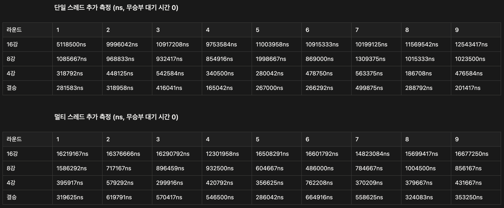
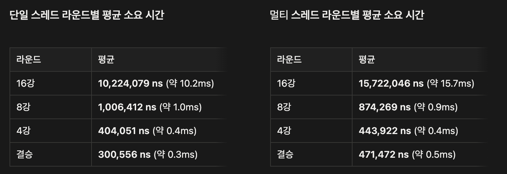
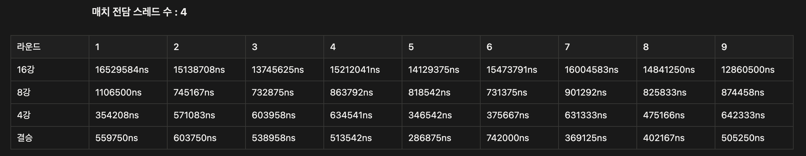
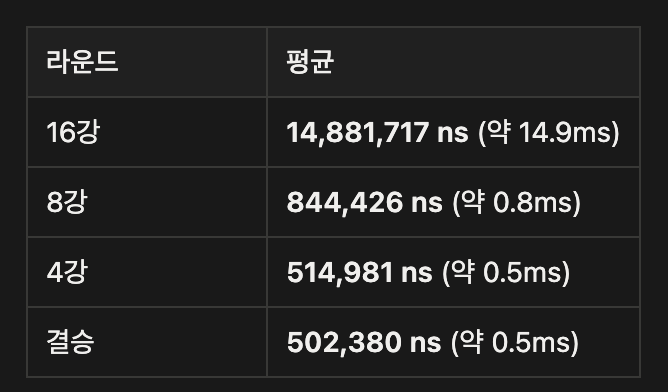
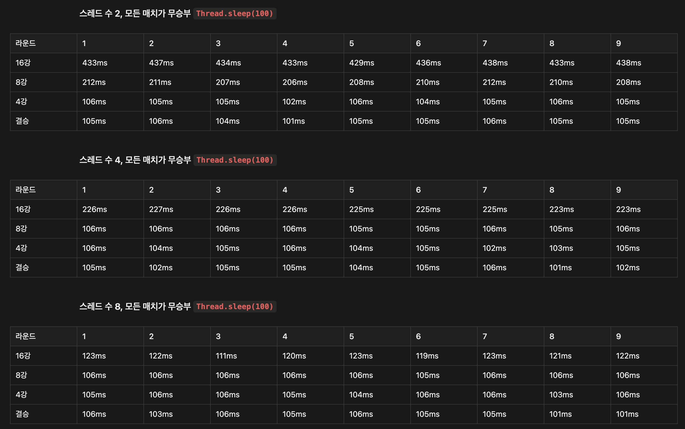
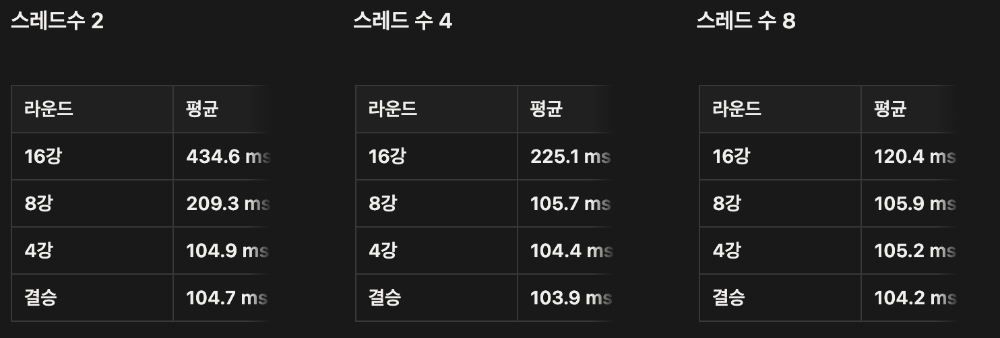

# Sports-simulator-2

---

## 목차

[**개발과정 기록**](#devlog)
1. [Gradle 빌드 도구 도입 배경](#gradle)
2. [1주차 피드백 반영 주요 리팩토링, 변경 사항](#refactoring)
    - 2-1) FootballTeam 객체를 TournamentParticipant 내부 필드로 변경
    - 2-2) MatchService 내 fight() 메서드 개선
    - 2-3) UEFA 참가 팀 정보, enum 합치기
    - 2-4) 가독성을 떨어뜨리는 상수화 제거
    - 2-5) setter 위험성 개선
    - 2-6) MatchService 내 fight() 과중 책임
3. [멀티스레드 기획](#multithread-plan)
4. [컨트롤러 추가 리팩토링](#controller)
5. [멀티스레드 적용 과정 : ExecutorService](#executorservice)
6. [멀티스레드 적용 성능 개선 확인](#performance)
7. [시간 소요 원인 파악](#cause)
8. [적절 스레드 수 설정](#thread-count)

[**회고**](#retrospect)

---

## <a id = "devlog"></a>개발 과정 기록

### <a id="gradle"></a>1. `Gradle 빌드 도구 도입 배경`

기존 1주차 과제에서는 기본 IntelliJ 빌드를 활용하였으나, 실제로 깃허브에서 다른 자바 프로젝트나<br/>
Spring Boot 프로젝트를 살펴보면 `Gradle`빌드 도구를 많이 활용하는 것을 확인할 수 있었다.<br/>
이에 `Gradle`을 썼을 때와 `IntelliJ`를 썼을 때의 차이점이 궁금하여 찾아보니

기존 IntelliJ의 기본 빌드 방식을 사용하면 IDE의 환경에 의존하여 프로젝트를 빌드하고 실행하기에<br/>
개발자마다 설정이나 실행 환경에 따라 다른 실행 결과가 나타남을 알 수 있었다.<br/>
즉, 내 개발 환경에서는 정상 동작하지만 다른 실행 환경에서 동작하지 않는 문제가 발생할 수 있다는 것이었다.

Gradle은 프로젝트의 빌드 과정이나 의존성 관리를 코드 기반으로 표준화할 수 있다. <br/>
`build.gradle` 파일에 필요한 라이브러리와 빌드 설정을 명시함으로,<br/>
개발 환경이 달라도 동일한 방식으로 프로젝트를 빌드하고 테스트할 수 있는 것이다.

추가적으로 Spring Boot와의 연동성이나 CI/CD 환경 구축 등에 장점이 있으나<br/>
멀티스레드를 도입하며 개별 동작 과정을 테스트함에 단순 `System.out`을 통한 콘솔을 통해 확인하는 것은<br/>
다른 실행 환경에서는 문제가 발생할 수 있다는 생각이 들었기에<br/>
일관된 빌드 및 테스트 수행이 가능하다는 점에서 `Gradle` 빌드 도구를 도입하게 되었다.<br/>
(추가로 실제 프로젝트에서 많이 쓰이는 빌드 도구인 만큼 익숙해지기 위해 도입하였다)

<br/>

### <a id="refactoring"></a>2. `1주차 피드백 반영 주요 리팩토링, 변경 사항`

#### 2-1) FootballTeam 객체를 TournamentParticipant 내부 필드로 변경
    기존 1주차에선 이차 상속을 위해 ( Team <- FootballTeam <- UefaTeam ) 구조로 클래스를 만들었으나
    UefaTeam이 가지는 의미는 축구팀의 종류가 아닌 "UEFA 토너먼트에 참가하는 팀"이라는 정보에 가까웠기에
    TournamentParticipant 클래스 필드에 FootballTeam 객체를 컴포지션하는 구조로 변경하였다.

#### 2-2) MatchService 내 fight() 메서드 개선
    MatchService의 fight() 메서드는 인자로 전달된 두 팀의 경기 진행을 의미하기에
    기존 코드의 내부 강제 형변환(UefaTeam) 과정에서 UefaTeam이 아닌 객체는 해당 메서드를 사용할 수 없었다.
    따라서 fight()의 인자로 Winnable 인터페이스를 구현한 객체를 전달할 수 있게 하여
    (우승 확률을 가진 팀만 fight()가 가능하다)
    MatchService 자체가 UEFA 토너먼트만을 위한 서비스가 아닌 전체 Match(경기)를 위한 서비스가 되도록 하였다.

#### 2-3) UEFA 참가 팀 정보, enum 합치기
    기존 코드에선 for문을 통한 순회로 idx에 따라 팀의 이름 담당 enum, 팀의 우승 확률 담당 enum을 순회하였다.
    그러나 이러한 방식은 각 enum 내부에서 순서가 하나라도 바뀌면 잘못된 정보가 들어간 객체가 만들어진다.
    이에 토너먼트 대회를 참가하는 팀의 정보(이름, 우승 확률)를 하나의 enum으로(UefaTeamInfo) 관리하도록 하였다.

#### 2-4) 가독성을 떨어뜨리는 상수화 제거
    기존 전체 코드 내에서 단순 리터럴로 숫자를 입력하여도 의미가 전달되는 부분까지 enum을 통해 상수화하였는데
    해당 부분은 오히려 가독성을 떨어뜨리기에 리터럴로 작성하여도 의미 파악이 되는 부분은 상수화를 제거하였다.

#### 2-5) setter 위험성 개선
    팀 내 부상 횟수를 설정하는 setOccurInjuryCount()와 우승 확률을 설정하는 setWinningRate()의 경우
    내부에 잘못된 값이 전달되어도 코드가 실행되어 의도와 다른 동작(에러)이 발생할 수 있다.
    이에 부상 횟수의 경우 Injurable 인터페이스를 상속하게하여 injure() 메서드를 구현하도록 강제해
    이를 구현한 TournamentParticipant에서 오직 증가만(++) 가능하도록 변경하였으며,
    Winnable인터페이스의 setWinningRate(double rate)를 구현한 곳에서 내부에 if분기를 통한 예외를 던지게 하였다.

#### 2-6) MatchService 내 fight() 과중 책임
    기존 fight() 메서드의 경우 내부에서 부상 관련 로직 + 우승 확률 조절 + 승자 결정 로직을 모두 담당하였다.
    이를 fight(Winnable teamA, Winnable teamB) 메서드 내 코드를 다음처럼 설정하여
    applyInjuries(teamA, teamB);
    return decideWinner(teamA, teamB);
    전체 경기의 흐름을 담당하게 하였고, 각 부상처리로직, 승자결정로직은 타 메서드로 책임을 변경하였다.

<br/>

### <a id = "multithread-plan"></a>3. `멀티스레드 기획`

가장 먼저 어느 부분을 스레드로 나누어 처리하면 성능이 향상될 수 있을 지 고민했다.

직관적으로 떠오른 부분은 각 토너먼트의 라운드마다(16강, 8강, 4강, 결승) 진행되는 매치를 각각 스레드로 관리하는 것이다.<br/>

```text
ex) 16강의 경우
    컨트롤러에서 스레드를 8개 생성
    -> 각 스레드에서 매치 진행
    -> 매치가 종료되면 컨트롤러에 종료를 알린다. (매치 종료 카운트 1 증가)
    컨트롤러에서는 매치 종료 카운트를 확인하며 카운트가 8이 되면 다음 로직(8강)을 진행한다.
```

위와 같은 방식으로 진행하면, 매치종료카운트라는 공유자원을 멀티스레드가 동시에 수정하여 동시성 문제가 발생할 수 있기에<br/>
동기화 도구를 사용하여 이를 해결할 수 있기에 학습한 개념을 적용하기에 적합하다 생각하였다.

다만, `"이러한 멀티스레드 도입이 통해 실제 성능 향상으로 이어질까?"`란 고민이 들었다.

**스레드를 생성하고, 종료하는 비용이**<br/>
각 스레드에서 매치를 처리하고 수행하도록 하여 **동시에 진행하게 함으로 얻는 이점**보다 크진 않을까?

이에 다음과 같이 멀티스레드 계획을 구상하였다.

1. 각 매치가 진행될 때 `내부 로직을 더 구체화`하여, 멀티스레드 적용의 이점을 늘린다.

```java
// 매치 구체화 기획

매치(A팀, B팀) {
    while(경기진행시간 != 풀타임) {
        공격자_선택_로직(A팀, B팀) // 공격 기회를 얻는 팀을 정한다, 기존 승리자 결정 로직을 차용 (winningRate기반 비교 방식)
        공격자_선택된_팀.공격시도(수비팀) // 공격자로 선택된 팀이 상대 팀에게 공격을 시도, 내부에서 수비팀의 수비능력치에 따라 공격 성공이 결정
        공격_결과적용() // 공격의 결과가 성공이라면 공격성공카운트 증가
        경기진행시간증가()
    }
}

```

2. 스레드를 매 라운드마다 생성하고 종료하는 비용은 너무 클 것이다. 따라서 `스레드 풀을 통해 재사용`한다.

```java
import java.util.concurrent.ExecutorService;

ExecutorService pool = Executors.newFixedThreadPool(8);
```

<br/>

### <a id = "controller"></a>4. `컨트롤러 추가 리팩토링`

멀티스레드를 기존 기획대로 도입하기 위해, 컨트롤러의 코드를 살펴보았으나 한 번에 구조를 알아보기 힘들었고<br/>
자연스럽게 어느 부분에 스레드를 도입해야할지 생각하는 과정이 너무 오래걸렸다.<br/>
따라서 전체적으로 가독성을 향상시킨 후 스레드를 도입하잔 생각이 들어 내부를 살펴보았다.

메서드명만 나눠져 있을 뿐 사실상 동일 동작을 수행하는 `16강 실행 메서드`와 `8강 실행 메서드`를 발견하였고<br/>
`4강 실행 메서드`, `결승 실행 메서드`를 포함하여 모든 라운드마다 크게 다음 두 가지 메서드를 실행함을 확인하였다.

- **대진표 작성(createBracket)** : `16강`, `8강`
- **경기 진행(progressMatch)** : `16강`, `8강`, `4강`, `결승`

이에 기존 `run()` 메서드 자체 구조를

```java
    public void run() {
    init();

    try {
        List<TournamentParticipant> winners = playRoundOf16();
        List<TournamentParticipant> semiFinalsTeams = playQuarterFinals(winners);

        playFinal(
                playSemiFinals(semiFinalsTeams)
        );
    } catch (IllegalArgumentException e) {
        System.out.println(e.getMessage());
    }
}
```

다음처럼 변경하였고

```java
    public void run() {
        init();

        try {
            bracketAndProgressMatch(TournamentConstant.ROUND_OF_16.getValue());
            bracketAndProgressMatch(TournamentConstant.QUARTER_FINALS.getValue());
            playSemiFinals(TournamentConstant.SEMI_FINALS.getValue());
            playFinal(TournamentConstant.FINAL.getValue());

        } catch (IllegalArgumentException e) {
            System.out.println(e.getMessage());
        } finally {
            iv.close(); // 기존엔 playFinal() 내부에 있었으나, 메서드의 동작과 관련이 없기에 finally로 이동
        }
    }
```

본래 이전 라운드 팀 목록을 인자로 받아 새로운 승자 팀 리스트 만드는 방식으로 진행하였으나,

```java
//private final List<TournamentParticipant> totalTeams = new ArrayList<>();
private List<TournamentParticipant> teams = new ArrayList<>();
```

기존 `totalTeams` 필드에서 `final`키워드를 제거하여 동일 변수를 재활용하도록 하였다.<br/>
또한 라운드 진행에 해당하는 메서드의 매개변수로 enum(`TournamentConstant`) 상수를 활용하여,<br/>
가독성을 증가시키고자 하였다.

하단은 수정된 각 라운드의 내부 코드이다.

```java
private void bracketAndProgressMatch(int roundInfo) {
    ov.displayTeamsMessage(teams);
    teams = createBracket(teams.size(), teams);
    teams = progressMatch(roundInfo, teams);
}

private void playSemiFinals(int roundInfo) {
    ov.displayTeamsMessage(teams);
    teams = progressMatch(roundInfo, teams);
}

private void playFinal(int roundInfo) {
    teams = progressMatch(roundInfo, teams);
    ov.finalWinnerMessage(teams.getFirst());
}
```

이전 컨트롤러와의 차이점도 살펴보고, 새 컨트롤러 동작 중 문제가 발생하면 참고하고자<br/>
기존 `UefaController`는 남겨두고, 새로운 `EnhancedUefaController`를 생성하였다.

<br/>

### <a id = "executorservice"></a>5. `멀티 스레드 적용 과정 : ExecutorService`

전체 토너먼트 시나리오의 흐름을 담당하는 컨트롤러 내 `progressMatch()`메서드에서 각 매치를 진행한다.

```java
private List<TournamentParticipant> progressMatch(int teamsCount, List<TournamentParticipant> teams) {
    List<TournamentParticipant> winners = new ArrayList<>();

    int roundMatchCount = 0;
    for (int i = 0; i < teamsCount; i += 2) {
        ov.printMatchInfo(teamsCount, ++roundMatchCount, teams.get(i), teams.get(i + 1));
        pressAnyKey();

        TournamentParticipant winner = ms.fight(
                teams.get(i),
                teams.get(i + 1)
        );
        winners.add(winner);
        ov.printWinner(winner);
    }

    return winners;
}
```

이때 각 경기의 매치를 멀티스레드로 진행하며 스레드풀을 이용해 라운드마다 생성, 종료 비용을 줄이고자<br/>
`ExecutorService` 인터페이스를 활용했으면 구현체로 `newFixedThreadPool`을 사용해 스레드 수를 고정하였다.

```java
// 컨트롤러의 멤버
private final ExecutorService pool = Executors.newFixedThreadPool(8);
```

스레드를 적용하기 앞서 progressMatch 내에서 입출력 관련 코드를 따로 빼내어<br/>
모든 연산이 진행되고 난후 입출력이 발생하게 수정하였다. (연산 부에 스레드를 적용하기 위해)

```java
private List<TournamentParticipant> progressMatch(int teamsCount, List<TournamentParticipant> teams) {
        List<TournamentParticipant> winners = new ArrayList<>();
        List<TournamentParticipant> losers = new ArrayList<>();
```

```java
    // 연산 부
    for (int i = 0; i < teamsCount; i += 2) {
        TournamentParticipant winner = ms.fight(
                teams.get(i),
                teams.get(i + 1)
        );

        TournamentParticipant loser = (winner == teams.get(i)) ? teams.get(i + 1) : teams.get(i);
        winners.add(winner);
        losers.add(loser);
    }
```
```java
    // 입출력 부
    int roundMatchCount = 0;
    for (int i = 0; i < teamsCount; i += 2) {
        ov.printMatchInfo(teamsCount, roundMatchCount + 1, teams.get(i), teams.get(i + 1));
        pressAnyKey();
        ov.printMatchResult(winners.get(roundMatchCount), losers.get(roundMatchCount++));
    }

    return winners;
}
```

이후 만들어 둔 스레드풀을 적용한 `progressMatch()` 메서드 내부 코드는 다음과 같다.

```java
List<Future<?>> futures = new ArrayList<>();
for (int i = 0; i < teamsCount; i += 2) {
    final int idx = i;
    futures.add(pool.submit(() -> {
        TournamentParticipant winner = ms.fight(
                teams.get(idx),
                teams.get(idx + 1)
        );
        TournamentParticipant loser = (winner == teams.get(idx)) ? teams.get(idx + 1) : teams.get(idx);

        synchronized (winners) {
            winners.add(winner);
        }
        synchronized (losers) {
            losers.add(loser);
        }
    }));
}
```

<br/>

### <a id = "performance"></a>6. `멀티스레드 적용 성능 개선 확인`

실제로 멀티스레드를 통한 동시 실행이 성능적 개선이 있는 지 확인해보기 위해<br/>

```java
long start = System.currentTimeMillis();

    (매치 로직)

long end = System.currentTimeMillis();
```

간단한 `System` 클래스의 `currentTimeMillis()` 메서드를 통해<br/>
멀티스레드 적용 전과 멀티스레드 적용 후의 차이를 확인해보았다.


빨간색은 해당 라운드에서 가장 오래 걸린 시간이며, 초록색은 해당 라운드에서 가장 빠르게 처리된 시간이다.

표본이 적은 것도 문제가 있겠지만, 위 데이터에서 아래와 같은 문제점들을 발견하였다.

1. **매치 로직에서 무승부 발생과 발생하지 않은 경우의 시간적 차이가 크다.**

    ```java
    int shootoutTime = rd.nextInt(FootballConstant.SHOOTOUT_TIME.getValue());
        try {
            Thread.sleep(shootoutTime);
            ...
    ```

    위 코드는 `MatchService` 내부 무승부 처리 로직이다. 무승부가 발생할 경우<br/>
    해당 스레드의 지연시간을 최대 **SHOOTOUT_TIME**(ms)만큼 발생하게 하였는데 이러한 스레드 지연시간이<br/>
    무승부가 발생하지 않을 경우의 로직 처리 시간보다 훨씬 크기에, 실행 시 마다 상이한 결과 데이터를 얻는 것이었다. 


2. **무승부가 아닌 경기만 존재할 경우, 해당 라운드의 시간 비교가 힘들다.**

    무승부가 아닌 매치들만 해당 라운드의 존재할 경우, **ms** 단위로는<br/>
    대부분 `0ms`, `1ms`의 데이터만 존재하였다. 따라서 스레드 적용으로 인한 확실한 차이를 확인하기 어려웠다.

이에 멀티스레드 적용을 통한 시간적 차이를 확인하기 위해<br/>

- **무승부 발생 시 스레드 대기 시간을 0으로 하고 (테스트를 위해)**
- `currentTimeMillis()`가 아닌 `nanoTime()`을 적용해 보다 정밀한 측정을 하기로 하였다.

**측정 결과**





단일 스레드에서 순차적으로 개별 매치를 진행할 때가<br/>
멀티스레드를 통해 동시에 실행할 때보다 훨씬 오래걸릴 것이라는 기대와 다르게

실제 수치를 살펴보면 **오히려 멀티스레드에서 더 많은 시간이 소요**되는 것을 확인할 수 있었다.

<br/>

### <a id = "cause"></a>7. `시간 소요 원인 파악`

앞선 성능 측정 시 실제론 멀티스레드 환경에서 시간이 더 오래 걸리는 원인 중 하나로 다음을 생각하였다.

1. `실제 매치 로직의 비용` > `스레드 컨텍스트 스위칭 비용`

즉, 멀티 스레드를 통해 동시 처리하여 로직을 동시 실행하는 이점보다<br/>
멀티스레드로 인한 컨텍스트 스위칭 과정에서 비용이 더 클 것이란 생각이었다. 

<br/>

2. `synchronized`로 `winners`, `losers` 객체에 접근

매치별 승자와 패자를 저장하는 각 리스트 객체에 접근할 때

```java
List<TournamentParticipant> winners = new ArrayList<>();
List<TournamentParticipant> losers = new ArrayList<>();

...

synchronized (winners) { winners.add(winner); }
synchronized (losers) { losers.add(loser); }
```

`synchronized`로 해당 객체의 락을 차지해야 하기에 스레드간 락 경쟁으로 인해 대기 시간이 발생할 것이란 생각이었다.

그러나 해당 부분은 `winners`와 `losers`에 각 매치 결과(승자, 패자)가 동일 인덱스에 저장되어야 하기에<br/>
위와 같은 기존 방식으로 할 경우 서로 다른 매치임에도<br/>
승자와 패자에 동일 순서(인덱스)로 저장되는 문제를 야기할 수 있다는 걸 해당 시간 소요 원인을 생각하던 중 파악하였다.

따라서 해당 리스트 객체를 초기화할 때 미리 크기를 지정하고

```java
List<TournamentParticipant> winners = new ArrayList<>(Collections.nCopies(teamsCount / 2, null));
List<TournamentParticipant> losers  = new ArrayList<>(Collections.nCopies(teamsCount / 2, null));
```

각 스레드(매치)가 서로다른 인덱스로 `winners`, `losers`에 접근하도록 하여 문제를 해결하였다.

```java
final int matchIdx = i / 2;
...

winners.set(matchIdx, winner);
losers.set(matchIdx, loser);
```

<br/>

예상 원인 중 두 번째 원인에 해당하는 `synchronized`의 경우 성능이 아닌 기능상 문제가 있기에<br/>
인덱스를 활용하여 락 경쟁을 제거하였기에 남은 첫 원인을 살펴보도록 하였다.

```java
private final ExecutorService pool = Executors.newFixedThreadPool(8);
```

기존 컨트롤러에서 사용하던 스레드 풀의 수는 16강 라운드의 총 매치 수인 `8`이었다.

스레드간 컨텍스트 스위칭 비용을 줄이고자 이를 반으로(`4`) 줄인 경우의 라운드별 시간을 측정하여 보았다.





기존 스레드 수를 `8`로 한 경우와 비교해보면 전체적으로 라운드별 평균 소요 시간이 빨라졌음을 확인할 수 있었다.<br/>

이를 통해 본 시스템(프로그램)에서는 매치 로직을 처리하는 시간적 비용이 적어

`스레드 수를 늘려 동시에 매치를 처리함으로 얻는 이득 비용`보다<br/>
`늘어난 스레드로 인한 컨텍스트 스위칭 비용`이 더 큼을 알 수 있었다.

추가로 모든 매치가 무승부 로직을 진행하는 상황을 고려하여 보았다. `(= 스레드로 분리한 작업의 비용이 큰 경우)`

스레드풀의 수를 `2, 4, 8`개로 나누어 `currentTimeMillis()`로 측정해 본 결과





16강의 경우 스레드 수 증가에 어느정도 선형적으로 비례하여 시간적 비용의 이득이 나타났고<br/>
8강의 경우 스레드 수가 4일 때부터 시간적 비용이 동일하게 saturation되었으며<br/>
4강과 결승의 경우 스레드 수가 2일때부터 모두 비슷한 시간적 비용이 나타났다.

16강의 경우 8개, 8강은 4개, 4강은 2개, 결승은 1개의 매치가 발생하기에<br/>
**각 라운드의 매치 수에 맞게 스레드 수가 있을 때** 시간적 이득을 최대로 봄을 알게 되었다.

**이를 통해 처리해야할 작업이 어느정도 큰 경우(해당 시스템에서는 무승부 로직)에<br/>
스레드 수를 늘리는 것이 성능 개선에 도움을 줌을 알 수 있었다.** 

**동시에 필요 스레드 수보다 과하게 사용할 경우엔<br/>
멀티스레드를 통한 시간적 비용 이득을 볼 수 없으며, 스레드의 컨텍스트 스위칭 비용만 상승함을 확인했다.**

<br/>

### <a id = "thread-count"></a>8. 적절 스레드 수 설정

앞선 `7. 시간 소요 원인 파악` 부에서 얻은 데이터를 바탕으로 시스템에 맞는 적절한 스레드 수를 고민하여 보았다.

초기에 기획하였을 때는 첫 라운드인 16강의 매치 수 `8`로 스레드 풀의 수를 고정하였으나

```java
private final ExecutorService pool = Executors.newFixedThreadPool(8);
```

본 시스템에서는 무승부가 아닐 경우의 작업이 컨텍스트 스위칭 비용보다 크기에 <br/>
초기 스레드 풀의 수를 모든 매치 수에 맞추어 설정하는 것은 단일 스레드보다 더 큰 비용이 발생함을 확인하였다.

그렇다고 단일스레드로 처리하기에는 모든 매치가 무승부를 진행하며 최대 작업 시간이 걸리는 최악의 경우

```java
int shootoutTime = rd.nextInt(FootballConstant.SHOOTOUT_TIME.getValue());
```

이론적으로 16강에서만 `SHOOTOUT_TIME * 8 + @`의 시간 비용이 발생한다.<br/>
따라서 앞선 모든 매치 무승부를 고려한 데이터의 선형적 성능 개선 데이터를 고려하여 스레드풀의 수를 정해야했다.

위 내용들을 반영하여, 본 시스템에서는 최악의 경우의 시간 비용을 막고, 컨텍스트 스위칭 비용을 어느정도 줄이고자<br/>

```java
private final ExecutorService pool = Executors.newFixedThreadPool(4);
```

스레드 풀의 수를 `4`로 설정하였다.

<br/>

---

## <a id = "retrospect"></a>회고

### 1. 새로운 기능추가 시 겪은 불편함

본 2주차 과제는 1주차 과제의 결과물에 새로운 기능(멀티스레드)을 추가하는 형식이었습니다.<br/>
앞선 개발 과정을 기록한 내용에서도 나타나지만, 새로운 기능을 추가하고자 기존 코드를 보며 많은 불편함을 느꼈습니다.

가장 불편했던 점은 하나의 메서드가 다양한 동작(기능)을 포함하고 있을 경우,<br/>
불과 기존 코드를 작성한 지 일주일도 안되었는데도 코드의 의도를 빠르게 파악하기가 쉽지 않았으며<br/>
보다 근본적으로 새로운 기능을 도입할 때 어느 부분에 해당 기능을 넣어야할지 막막했습니다.

이에 2주차 과제의 핵심 내용인 멀티스레드 환경 도입을 진행하기전에<br/>
기존 프로젝트 전반의 코드를 리팩토링함에 시간이 매우 많이 소요되었습니다. 이러한 전반의 과정을 통해<br/>
처음부터 완벽한 코드를 작성하기는 힘들지만,<br/>
그래도 최대한 메서드가 단일 책임을 가지게 작성하잔 마음을 가지고 코드를 작성해야겠다는 생각이 들었습니다.

### 2. 테스트 코드의 필요성

이번에 `gradle`을 도입하며 본 목적 중 하나는 사실 테스트 코드를 작성하는 것이었습니다.<br/>
그럼에도 테스트 코드 도구의 사용법이 익숙하지 않아 당장 과제를 완성하는 것이 더 중요하다 생각하여<br/>
`TournamentLogger` 클래스를 만들고, 코드를 수정하며 직접 데이터를 얻는 과정을 진행했습니다.

돌이켜보니 매번 직접 실행해서 데이터를 얻었는데, 초기 코드 작성에 시간이 들더라도<br/>
프로그램에 입력값을 넘기고 결과를 알아서 받는 자동화 방식을 만드는게,<br/>
성능 확인을 위한 데이터의 수도 많아지고 편리하기에 훨씬 좋았겠다란 아쉬움이 남습니다.<br/>
( 성능 측정을 위한 데이터 수가 적은게 아쉬웠습니다 )

테스트 코드를 통해 개별 클래스나, 메서드 단위로 기능 확인이 가능하단 유용성을 기존에 알고 있었는데<br/>
성능 개선을 위한 데이터를 수집할 때도 이러한 테스트 코드의 필요성이 있다는 것을 느꼈습니다.

다음부턴 과제, 프로젝트 등 모든 개발 과정에 테스트 코드 도구를 도입할 수 있도록 공부해야겠습니다.

### 3. 개발 과정 기록

지금까지 개인 프로젝트를 만들거나 과제를 진행할 때 별도의 개발 과정을 기록하진 않았습니다.<br/>
이번 2주차 과제에서는 어딘가에서 들은 "살아있는 `README`를 만들어라". 라는 조언을<br/>
적용하고, 이점을 직접 느끼고 싶어 직접 개발 과정을 기록하며 과제를 진행했습니다.

개발 초기부터 후반까지 글을 읽는 사람이 제가 어떤 생각을 가졌고 왜 이렇게 진행했는지 파악이 될 수 있도록 하고 싶었는데<br/>
지금 다시 전체 과정을 살펴보니 제대로 의도가 전해지지 않은 것 같아 아쉬움이 남았습니다.

이와 별개로 과정을 기록하며 개발함으로 머릿속에 과제의 전체 흐름과, 현재 진행 상태가 어느정도인지<br/>
쉽게 파악할 수 있었고 다음에 뭘 진행해야할지 생각하는 시간이 줄어들었던 것 같습니다.

하지만 개발 과정을 읽는 사람이 파악할 수 있도록 쓰고자 시간을 많이썼더니<br/>
전체 과제 진행 시간은 오히려 오래 걸렸던게 아쉽습니다. 의도를 드러내는 글을 쓰는 능력을 더 키워야 될 것 같습니다.

### 4. 막상 추가된 기능은 적은..

1주차 과제보다 훨씬 많은 시간을 들여 2주차 과제를 진행한 것 같은데<br/>
막상 결과를 보니 기존 코드 리팩토링만 많이 진행하고, 2주차 과제의 목적인 멀티스레드 기능 도입은 적어<br/>
배(멀티스레드 기능 구현)보다 배꼽(코드 개선)이 더 컸던 것 같아 아쉽습니다..

### 5. 내부 로직 구체화 과정

스레드로 동시 실행을 하기 위해, 각 스레드가 담당하는 작업을 구체화하는 과정을 진행했습니다.<br/>
그럼에도 실제 멀티스레드로 작업을 실행해보면 구체화한 작업의 로직은 실제 실행시간이 매우 빨리 끝나고<br/>
Thread.sleep()이 대부분의 스레드 작업 시간을 차지하였기에..

돌이켜 생각해보면 내부 로직에 공유자원에 대한 접근 과정을 만들고,<br/>
이를 차지하기 위한 락 대기 시간을 활용할 걸 그랬나 생각이 들었습니다.<br/>

그런데 이러한 방식은 또 생각해보니, 락 대기 시간이 단일스레드에서는 없기에<br/>
시간 측정을 통한 성능 판단에서는 무조건 단일스레드가 더 좋게 나올 것 같아,<br/>
결국 내부 연산 로직을 매우 많이 만들어서 실험하거나, 입출력 관련 로직을 스레드 내부 작업으로 넣어야 될 것 같습니다.